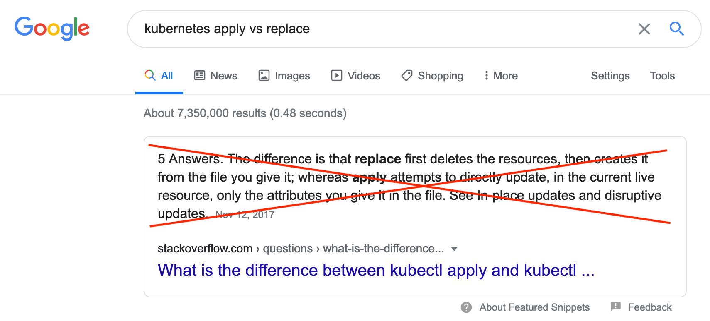

# Kubernetes Apply vs. Replace vs. Patch

Kubernetes offers several ways to update resources: apply, edit, patch, and replace. Unfortunately, there seems to be some confusion about what each does and when to use them. When <a href="https://web.archive.org/web/20220508130521/https://www.google.com/search?safe=strict&amp;q=kubernetes+apply+vs+replace">searching Google for ‘kubernetes apply vs replace’</a>, the <a href="https://web.archive.org/web/20220508130521/https://stackoverflow.com/questions/47241626/what-is-the-difference-between-kubectl-apply-and-kubectl-replace">highlighted answer provided from Stack Overflow</a> is <strong>wrong</strong>. When searching for ‘<a href="https://web.archive.org/web/20220508130521/https://www.google.com/search?safe=strict&amp;q=kubernetes+apply+vs+patch">kubernetes apply vs patch</a>’, the first entry of the results is the <code>kubectl patch</code> documentation, which does not include a comparison of <code>apply</code> and <code>patch</code>. This post explains the various approaches and when to use each.

<blockquote>Update: This post is now the first site returned by Google when searching for ‘kubernetes apply vs replace’, but the highlighted answer is still wrong. When searching for ‘kubernetes apply vs patch’, this post is the highlighted answer!</blockquote>

Sometimes during the lifecycle of a Kubernetes resource, e.g., a service, deployment, or ingress, specific properties of the resource need to be changed, added, or deleted. For example, an annotation needs to be added or the desired number of replicas of a deployment needs to be increased or decreased.

<h2 id="the-kubernetes-cli">The Kubernetes CLI</h2>

If you interact with your Kubernetes clusters using the <code><a href="https://web.archive.org/web/20220508130521/https://kubernetes.io/docs/reference/kubectl/overview/">kubectl</a></code> command-line interface (CLI), you are probably familiar with the <code>apply</code> and <code>edit</code> subcommands. The <code>apply</code> command reads resource specs from a file and “upserts”, i.e., inserts/creates a resource if it does not exist or updates it if it does, those resources in the Kubernetes cluster. The <code>edit</code> command reads the resource from the Kubernetes API, writes the resource specification, i.e., “spec”, into a local file, and opens that file up in a text editor for you. You can then edit and save the file and <code>kubectl</code> will send the changes you made back to the Kubernetes API, which takes care of effecting those changes upon the resource.

Likely less familiar are the <code>patch</code> and <code>replace</code> subcommands of <code>kubectl</code>. The <a href="https://web.archive.org/web/20220508130521/https://kubernetes.io/docs/tasks/run-application/update-api-object-kubectl-patch/"><code>patch</code> command</a> allows you to modify part of a resource spec, providing just the changed part on the command line. The <code>replace</code> command behaves kind of like a manual version of the <code>edit</code> command. You have to download the current version of the resource spec, e.g., using <code>kubectl get -o yaml</code>, edit it, and then use <code>kubectl replace</code> to update the resource using the modified spec. If any changes have occurred between reading and replacing the resource, the <code>replace</code> will fail.

<h2 id="the-kubernetes-api">The Kubernetes API</h2>

If you interact with your Kubernetes clusters using a <a href="https://web.archive.org/web/20220508130521/https://kubernetes.io/docs/reference/using-api/client-libraries/">Kubernetes client library</a> for your programming language of choice, you are probably familiar with methods like <code>CoreV1().Pods().Update()</code>, <code>replaceNamespacedService</code> or <code>patch_namespaced_deployment</code>. Underlying these client library methods are HTTP requests using the <code>PUT</code> and <code>PATCH</code> <a href="https://web.archive.org/web/20220508130521/https://developer.mozilla.org/en-US/docs/Web/HTTP/Methods">HTTP request methods</a>. The “update” and “replace” methods use <code>PUT</code> and the “patch” methods use, not surprisingly, <code>PATCH</code>.

It is worth noting that <code>kubectl</code> also interacts with your clusters using the Kubernetes API. In other words, <code>kubectl</code> is a command-line wrapper for the Go Kubernetes client library, while also providing a significant amount of <em>sugar</em> on top of the capabilities of the Kubernetes API. For example, you may have noticed no “apply” API methods were mentioned above. At present, all of the <code>kubectl apply</code> logic, i.e., the logic that creates non-existent resources and patches existing resources, lives entirely in the <code>kubectl</code> code base. There is an effort underway to <a href="https://web.archive.org/web/20220508130521/https://github.com/kubernetes/enhancements/issues/555">move the apply logic into the Kubernetes API</a>, but those efforts are still in beta. More on that below.

<h2 id="by-default-patch">By default, patch</h2>

When you want to update a resource, it is best to default to patching it. This is true whether using the Kubernetes client libraries or <code>kubectl</code>.

<h3 id="be-strategic">Be strategic</h3><!--kg-card-begin: markdown-->

Under the hood, the <code>kubectl</code> <code>apply</code>, <code>edit</code>, and <code>patch</code> commands all use the <code>PATCH</code> HTTP request method to update an existing resource. More specifically, they all use the <a href="https://web.archive.org/web/20220508130521/https://kubernetes.io/docs/tasks/run-application/update-api-object-kubectl-patch/#notes-on-the-strategic-merge-patch">strategic-merge patching</a> approach when updating resources, although <code>patch</code> can use other approaches (more on that below). The strategic-merge approach attempts to “do the right thing” when combining the provided spec with the existing spec. More specifically, it attempts to merge both objects and arrays, meaning changes tend to be additive. For example, providing a patch that contains a single, new environment variable in a pod container spec results in that environment variable being added to the existing environment variables, not overwriting them. To delete a property with this approach, you need to specifically set its value to <code>null</code> in the provided spec. So among the updating <code>kubectl</code> subcommands, which is best to use?

If you create and manage your resources using <code>kubectl apply</code>, it is best to always use <code>kubectl apply</code> when updating so <code>kubectl</code> can manage the configuration and properly track the requested changes from apply to apply. The advantage of always using <code>apply</code> is that it keeps track of the previously applied spec, allowing it to know when spec properties and array elements are explicitly removed. This allows <code>apply</code> to remove properties and array elements when a normal strategic merge would not. The <code>edit</code> and <code>patch</code> commands do <em>not</em> update the annotation <code>kubectl apply</code> uses to track its changes, so any changes made by <code>edit</code> and <code>patch</code>, while tracked and made manifest by the Kubernetes API, are <em>invisible</em> to subsequent <code>apply</code> commands, meaning that <code>apply</code> will not remove them even if they do not appear in the <code>apply</code> input spec<a href="#fn1" id="fnref1">[1]</a>.

If you are not using <code>kubectl apply</code>, you can use both <code>edit</code> and <code>patch</code> interchangeably, selecting whichever command suits the specific change you are trying to make. When adding and changing spec properties, both approaches are more or less equivalent. When removing spec properties or array elements, <code>edit</code> behaves like a one-time-use <code>apply</code>, i.e., it keeps track of what the spec was before and after you edit it so it can explicitly remove properties and array elements from the resource. Using <code>patch</code>, you have to explicitly set the value of a property to <code>null</code> in the patch spec to remove it from the resource. Removing an array element using a strategic merge patch is more complicated, <a href="https://web.archive.org/web/20220508130521/https://github.com/kubernetes/community/blob/master/contributors/devel/sig-api-machinery/strategic-merge-patch.md#delete-directive">requiring the use of merge directives</a>. See the other patching approaches below for more reasonable alternatives.

To have the “patch” client library methods behave similarly to the above <code>kubectl</code> patching subcommands, you should set the <code>content-type</code> header in the request to <code>application/strategic-merge-patch+json</code>. Like with <code>kubectl patch</code>, if you want to remove spec properties, you will need to explicitly set their values to <code>null</code>. If you want to remove array elements, you will need to include merge directives in your patch spec or use a different patching approach.

<section class="footnotes">
<ol class="footnotes-list">
<li id="fn1" class="footnote-item">
  
The <a href="https://web.archive.org/web/20220508130521/https://kubernetes.io/docs/concepts/cluster-administration/manage-deployment/#kubectl-apply">Kubernetes documentation</a> states that <code>edit</code> and <code>patch</code> do update the annotation used by <code>kubectl apply</code>, but in practice that is not the case. <a href="#fnref1" class="footnote-backref">↩︎</a>

</li>
</ol>
</section>

<!--kg-card-end: markdown-->

<h3 id="other-patching-approaches">Other patching approaches</h3>

Kubernetes supports two other patching approaches: <a href="https://web.archive.org/web/20220508130521/https://kubernetes.io/docs/tasks/run-application/update-api-object-kubectl-patch/#use-a-json-merge-patch-to-update-a-deployment">JSON merge patch</a> and <a href="https://web.archive.org/web/20220508130521/https://erosb.github.io/post/json-patch-vs-merge-patch/">JSON patch</a>. Like the strategic-merge approach, the JSON merge patch approach accepts a partial Kubernetes spec as input and supports merging objects. The JSON merge patch approach differs from the strategic-merge approach in that it only supports replacing arrays. This includes the <code>containers</code> array in a pod spec. That means when using the JSON merge approach, you need to supply complete specs for all of the containers if you want to change any property of any container. As such, the JSON merge patch approach is useful if you want to remove elements from from an array in a spec. On the command line, you can select JSON merge patch using <code>kubectl patch --type=merge</code>. When using the Kubernetes API, JSON merge patch is used when accessing a Kubernetes resource endpoint using the <code>PATCH</code> request method and setting the <code>content-type</code> request header to <code>application/merge-patch+json</code>.

Rather than providing a partial resource spec, the JSON patch approach uses a JSON representation of the changes you want to make to a resource. A JSON patch is an array where each element of the array is a description of a change to make to the resource. JSON patch is a more flexible and powerful way to express the changes you want to make, but comes at the cost that you are no longer sending a partial resource spec, but a set of changes you want made in a distinct, non-Kubernetes-spec format. On the command line, you can select JSON patch using <code>kubectl patch --type=json</code>. When using the Kubernetes API, JSON patch is used when accessing a Kubernetes resource endpoint using the <code>PATCH</code> request method and setting the <code>content-type</code> request header to <code>application/json-patch+json</code>.

<h2 id="when-you-need-to-be-certain-replace">When you need to be certain, replace</h2>

There may be certain instances when you want to be sure that no changes have been made to a resource between the time you read the resource and when you are updating it. Put another way, you need to make sure all changes to a resource are <em>atomic</em>. This is the use case for updating a resource using replace. For example, if you have a ConfigMap with a counter that is updated by multiple sources, you may want to make sure that two sources do not attempt to update the counter simultaneously, causing you to “lose” an update. To illustrate, imagine this sequence of events using the patching approach.
<ol><li>A and B get the current state of the resource from the Kubernetes API.</li><li>Both A and B locally update the spec, incrementing the counter from <em>n</em> to <em>n+1</em> and appending “A” and “B”, respectively, to the “updated-by” annotation.</li><li>A is a bit quicker and patches the resource.</li><li>B patches the resource.</li></ol>

The result is that the A update is lost. The last patch operation wins and the counter ends up only being incremented by one instead of two and the value of the “updated-by” annotation ends with “B” and has no “A”. Compare the above to what happens when the updates are done using the replace approach.
<ol><li>A and B get the current state of the resource from the Kubernetes API.</li><li>Both A and B locally update the spec, incrementing the counter from <em>n</em> to <em>n+1</em> and appending “A” and “B”, respectively, to the “updated-by” annotation.</li><li>A is a bit quicker and replaces the resource.</li><li>B attempts to replace the resource but the update is rejected by the API because the resource version in the replacement spec does not match the current resource version in Kubernetes because the resource version was incremented when the A replace operation was made.</li></ol>

In the above case, source B will have to fetch the resource again, make its changes against the new state, and attempt to replace again. The result will be that the counter will have been incremented by two and the “updated-by” annotation will end with “AB”.

Implicit in the above example is that replacing a resource is just that: replacing the <em>entire</em> resource. The spec supplied in the replace request should be the fully formed resource spec, not a partial spec and not just the parts required when using <code>kubectl apply</code>. In particular, you <em>must</em> include the current <code>resourceVersion</code> in the <a href="https://web.archive.org/web/20220508130521/https://kubernetes.io/docs/reference/generated/kubernetes-api/v1.18/#objectmeta-v1-meta">spec metadata</a>. If you do not include the <code>resourceVersion</code> or the version you provide is not the current one, the replacement will be rejected. As such, the best approach for using replace is to read the resource, update it, and replace it, immediately. Using <code>kubectl</code>, this might look like
<pre><code class="language-console">$ kubectl get deployment my-deployment -o json \
    | jq '.spec.template.spec.containers[0].env[1].value = "new value"' \
    | kubectl replace -f -</code></pre>
That being said, you may have noticed that you can successfully run these two commands in sequence
<pre><code class="language-console">$ kubectl create -f deployment.yaml
$ kubectl replace -f deployment.yaml</code></pre>
as long as the <code>deployment.yaml</code> does <em>not</em> specify the <code>.metadata.resourceVersion</code> property. That seems to directly contradict what I said above, i.e., “you <em>must</em> include the current <code>resourceVersion</code> in the spec metadata.” So is that statement wrong? No, it is not. What is happening under the hood is that <code>kubectl</code> notices you have not supplied the <code>resourceVersion</code> so it reads the resource from Kubernetes, adds the current <code>resourceVersion</code> to the spec you provided, and only then performs the replace request. Since that magic, which is dangerous if you are relying on the atomic nature of replace, resides entirely in <code>kubectl</code>, you cannot rely on it when using a Kubernetes API client library. In that case, you will have to <code>GET</code> the current resource spec, update it, and then issue the <code>PUT</code> request.

<h2 id="when-you-can-t-patch-forcibly-replace">When you can't patch, forcibly replace</h2>

Sometimes you need to make changes to a resource that are not allowed by the Kubernetes API. In these instances, you can <a href="https://web.archive.org/web/20220508130521/https://kubernetes.io/docs/concepts/cluster-administration/manage-deployment/#disruptive-updates">forcibly replace the resource</a>, effectively deleting and re-creating the resource. This is done using <code>kubectl replace --force</code> on the command line. This forcibly and immediately deletes the resources and then re-creates it with the provided spec. There is no “force replace” API endpoint. To perform a similar operation using the Kubernetes API, you have to perform two separate operations. First, you must delete the resource, setting <code>gracePeriodSeconds</code> to zero (0) and <code>propagationPolicy</code> to “Background”, and then re-create the resource using the desired spec.
<blockquote><strong>This approach can be disruptive and result in an inconsistent state!</strong></blockquote>

<h2 id="server-side-apply">Server-side apply</h2>

As mentioned above, the Kubernetes developers are working on implementing the apply logic in <code>kubectl</code> within the Kubernetes API. The beta 2 <a href="https://web.archive.org/web/20220508130521/https://kubernetes.io/docs/reference/using-api/api-concepts/#server-side-apply">server-side apply logic</a> is available in <a href="https://web.archive.org/web/20220508130521/https://kubernetes.io/blog/2020/04/01/kubernetes-1.18-feature-server-side-apply-beta-2/">Kubernetes 1.18</a> via <code>kubectl apply --server-side</code> on the command line and on resource API endpoints using the <code>PATCH</code> request method with the <code>content-type</code> header value set to <code>application/apply-patch+yaml</code>.
<blockquote>Note: JSON is valid YAML, so you can send a JSON spec when <code>content-type</code> is <code>application/apply-patch+yaml</code>.</blockquote>

Aside from simply making <code>kubectl apply</code> logic available to all clients via the API, the server-side apply implementation tracks who is responsible for which fields in the spec, allowing multiple “field managers” to safely edit different portions of a spec without unknowingly conflicting. In other words, when server-side apply is more generally available, it will provide a mechanism for different clients, e.g., <code>kubectl</code>, <a href="https://web.archive.org/web/20220508130521/https://www.pulumi.com/">Pulumi</a> or <a href="https://web.archive.org/web/20220508130521/https://www.terraform.io/">Terraform</a>, <a href="https://web.archive.org/web/20220508130521/https://www.weave.works/technologies/gitops/">GitOps</a>, and a script you wrote using a Kubernetes client library, to all manage the same resources safely.

<h2 id="wrapping-up-dates-">Wrapping up(dates)</h2>

Hopefully this brief trip through the various ways to update resources in your Kubernetes clusters has been helpful. We have learned that the combatants are not just apply vs. replace, you can update a resource with apply, edit, patch, or replace. And really, it is not <em>Kubernetes apply vs. replace</em> or <em>Kubernetes apply vs. patch</em>, each approach has specific use cases in mind. If you need atomic updates, using <code>kubectl replace</code> or a <code>PUT</code>/replace/update API call is the way to go. Otherwise, using a strategic-merge patch via <code>kubectl apply</code> or a <code>PATCH</code> API call is usually the best choice. At the very least, I hope you have learned that you should not trust Google or Stack Overflow when searching for ‘kubernetes apply vs replace’. That is, until this post replaces the current answer. If you have any questions, ping me on <a href="https://web.archive.org/web/20220508130521/https://twitter.com/ddgenome">Twitter</a> or in the <a href="https://web.archive.org/web/20220508130521/https://join.atomist.com/">Atomist community Slack</a>.

<figure class="kg-card kg-image-card kg-card-hascaption"><figcaption>Kubernetes apply vs replace? Nope!</figcaption></figure>

## License

[CC BY-SA 4.0](https://creativecommons.org/licenses/by-sa/4.0/)
